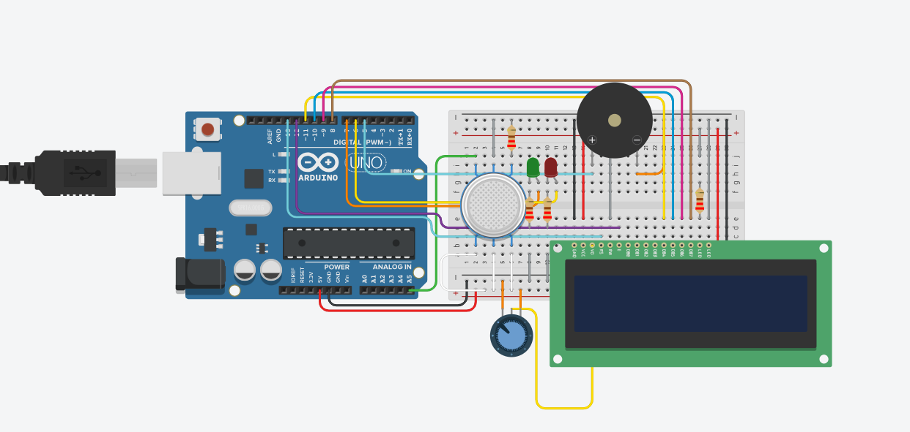

# 🛡️ Arcanjos - Sistema de Incêndio

Este repositório contém o projeto de sistemas embarcados desenvolvido para a empresa **Arcanjos**, com foco em uma solução inteligente e acessível para **detecção de fumaça e alerta de incêndio**, simulado na plataforma **Tinkercad**.

---

## 🚀 O Produto

O **Sistema de Incêndio Arcanjos** é um dispositivo baseado em **Arduino Uno**, que monitora o ambiente em tempo real e reage automaticamente a situações de risco.

O sistema é capaz de:

- 🔍 Detectar fumaça  
- ⚠️ Alertar com sinais visuais e sonoros  
- 📟 Informar o status em um display LCD  

---

## 👥 Equipe de Desenvolvimento

- **Diego Ximenes**  
- **Luiz Eduardo**

---

## 🛠️ Tecnologias e Componentes

- **Plataforma:** Tinkercad  
- **Microcontrolador:** Arduino Uno R3  
- **Linguagem:** C++ (Arduino)

### 🔌 Componentes utilizados:

- Sensor de gás (detecção de fumaça)
- LED Verde (estado normal)
- LED Vermelho (alerta)
- Buzzer (sirene)
- Display LCD 16x2
- Resistores e jumpers

---

## 🔧 Montagem do Circuito

### 📌 Ligações principais:

- **Sensor de fumaça → A5**
- **LED Verde → Pino 7**
- **LED Vermelho → Pino 6**
- **Buzzer → Pino 5**
- **LCD:**
  - RS → 13  
  - E → 12  
  - D4 → 11  
  - D5 → 10  
  - D6 → 9  
  - D7 → 8  

---

## 📋 Passo a Passo de Execução

### 1️⃣ Montar o circuito
Monte todos os componentes conforme o esquema no **Tinkercad** ou em uma protoboard.

> Monte o circuito conforme o esquema acima.
---

### 2️⃣ Configurar o código
- Abra o Arduino IDE ou Tinkercad  
- Cole o código do projeto  
- Verifique se os pinos estão corretos  

---

### 3️⃣ Iniciar o sistema
Ao iniciar, o sistema irá:

- Mostrar no LCD:

SISTEMA LIGANDO
MONITORANDO...

- Após 2 segundos, entra em modo normal  

---

### 4️⃣ Monitoramento contínuo

O sistema entra em loop e:

- Lê o valor do sensor de fumaça  
- Exibe no monitor serial  
- Mantém o ambiente seguro enquanto não há fumaça  

---

### 5️⃣ Detecção de fumaça (ALERTA)

Quando o valor do sensor ≥ **55**:

- 🔴 LED vermelho liga  
- 🟢 LED verde desliga  
- 🔊 Buzzer toca (sirene)  
- 📟 LCD mostra:

  !!! ALERTA !!!
FUMACA DETECTADA.

---

### 6️⃣ Retorno ao normal

Quando o valor do sensor ≤ **40**:

- 🔴 LED vermelho desliga  
- 🟢 LED verde liga  
- 🔇 Buzzer para  
- 📟 LCD mostra:

AMBIENTE SEGURO
SEM FUMACA

---

## 🧠 Lógica do Sistema

O sistema utiliza **histerese**:

- Entra em alerta com valor ≥ 55  
- Sai do alerta com valor ≤ 40  

Isso evita que o sistema fique alternando rapidamente entre os estados.

---

## 💡 Funcionamento Resumido

| Situação | LED Verde | LED Vermelho | Buzzer | LCD |
|----------|----------|-------------|--------|-----|
| Normal   | ON       | OFF         | OFF    | Ambiente seguro |
| Alerta   | OFF      | ON          | ON     | Fumaça detectada |

---

## 📌 Observações

- Os limites podem ser ajustados conforme o sensor  
- O sistema pode ser expandido com:
- Servo motor (sprinkler)
- Integração com app
- IoT para notificações  

---

## 🏁 Conclusão

O projeto demonstra como sistemas embarcados podem ser aplicados na **segurança**, integrando sensores e atuadores de forma simples, eficiente e acessível.

---

<b>Arcanjos</b>

